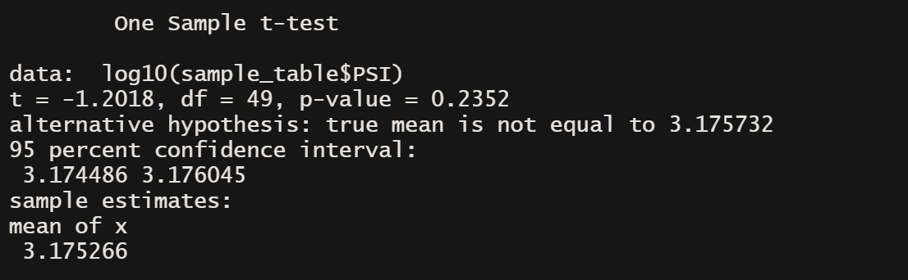

# MechaCar_Statistical_Analysis

## Linear Regression to Predict MPG 

It appears the intercept, vehicle length, and ground clearance all have a notable impact on the mpg for the prototypes since the p-values for each of these variables are less than the significance level of  0.05%. Since not all variables are attributed to random chance, the slope would not be zero. The r-squared value is 0.71 meaning that there is a high probability that any prototype additions to the dataset will have the mpg accurately predicted with this model. 

## Summary Statistics on Suspension Coils

From the total summary in the first image, it is evident that the variance in the suspension coils' PSI for all lots is 62 and below the 100 PSI limit. 

The lot summary shows that lot 1 and lot 2 are each within the PSI limit having a .98 and 7 variance respectively. Lot 3, however, has a variance of 170 pounds meaning that it doesn't meet the design specifications.

## T-Tests on Suspension Coils 

The t-test applied to all manufacturing lots resulted in a p-value of 0.2352 which is above the 
0.05 percent significance level. This conclusion suggests that there is not sufficient evidence to reject the null hypothesis. Therefore, the PSI of a 50 vehicle sample across various lots is similar to the population mean of 1,500 pounds per square inch.

The p-value for lot 1 is far less than the 0.05 percent significance level, confirming that there is sufficient evidence to reject the null hypothesis and the PSI of lot 1 is different from the population mean.

The p-value for lot 2 is less than the 0.05 percent significance level as well, confirming that there is sufficient evidence to reject the null hypothesis and the PSI of lot 1 is different from the population mean.

Lastly, the p-value for lot 3  is above the 0.05 percent significance level, so there is not sufficient evidence to reject the null hypothesis and the PSI is similar to the population mean.

## Study Design: MechaCar vs Competition

### Most Popular Cars
A helpful analysis to understand MechaCar's performance against competitors would be to look at the most popular cars from MechaCar's top competitor. This would ensure that MechaCar is comparing with a competitor that has similar goals in mind for the type of vehicles produced. If MechaCar's priority is safety, then it wouldn't be as meaningful to compare horsepower that emphasizes sports cars with high horse power. A two-sample t-Test could be used by gathering a data sample of MechaCar's 50 best-selling vehicles on the market and comparing the design and specifications to MechaCar's competitor. Using these two samples and a subset function, we could analyze costs associated with similar safety ratings from both manufacturers. The null hypothesis would be that there is no difference between the costs relative to the safety ratings and the alternative hypothesis would be that there is a significant difference between the costs relative to the safety ratings. 

